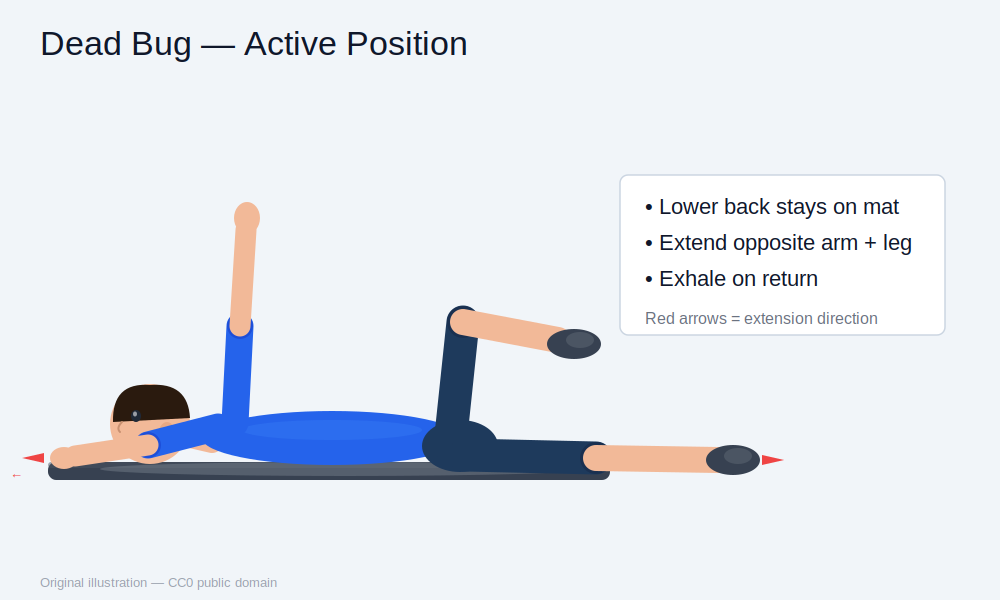
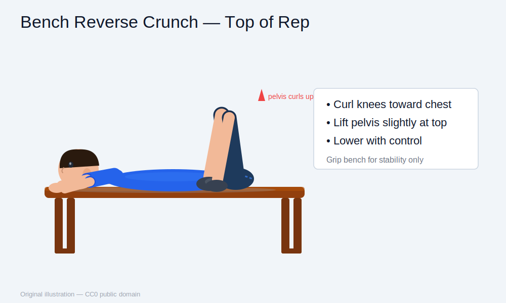
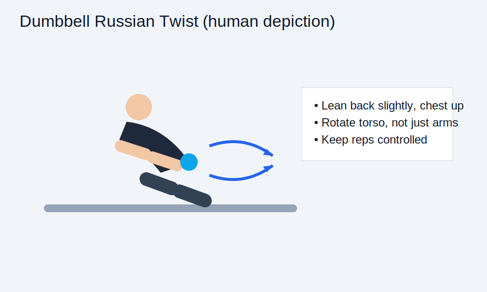
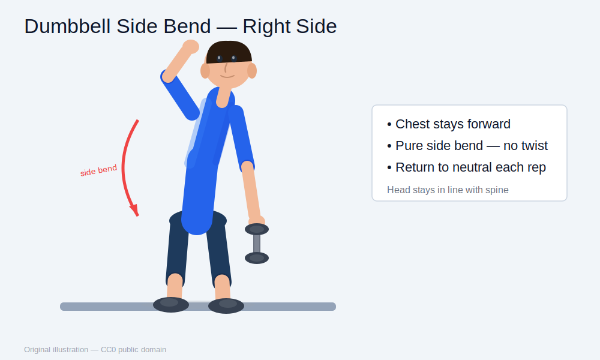

# Home Core Training Guide (Bench + Dumbbells Only)

## Goal
Build a stronger, more controlled core at home with minimal equipment, while supporting fat-loss training.

> Core training improves posture, stability, and abdominal control. Belly-fat reduction is driven primarily by diet and overall activity — core work supports that process, not the other way around.

---

## Equipment
- Flat bench
- 1–2 dumbbells
- Mat or towel (optional)

---

## Warm-up (3–5 min)
1. Cat-cow — 6 reps
2. Hip circles — 10/side
3. Bodyweight glute bridge — 10 reps
4. Slow dead-bug pattern — 4/side

---

## Main Exercises

### 1) Dead Bug
**Why:** Trains deep core stability and spinal control — protects the lower back under load.

**How to do it**
1. Lie on your back, arms extended toward the ceiling, knees and hips at 90°.
2. Brace your abs and press your lower back gently into the floor — hold this throughout.
3. Slowly extend your opposite arm and leg toward the floor.
4. Return to the start and repeat on the other side.

**Sets/Reps:** 3 × 8–12 per side | **Tempo:** slow and deliberate

**Form cues:** Keep your lower back pinned to the floor the entire rep. If it lifts, shorten your range of motion. Don't rush — the challenge is the control, not the speed.

**Guide image:**

---

### 2) Bench Reverse Crunch
**Why:** Targets lower-ab and pelvic control — harder to cheat than standard crunches.

**How to do it**
1. Lie on the bench and grip the bench edge behind your head for stability.
2. Start with knees bent, feet off the bench.
3. Draw your knees toward your chest, curling your pelvis slightly off the bench at the top.
4. Lower your legs slowly and with control — don't drop them.

**Sets/Reps:** 3 × 10–15

**Form cues:** The movement comes from your abs pulling your pelvis up, not from swinging your legs. Slow the lowering phase down — that's where most of the work happens.

**Guide image:**

---

### 3) Dumbbell Russian Twist
**Why:** Builds oblique strength and rotational control.

**How to do it**
1. Sit on the floor, lean your torso back slightly, chest tall.
2. Hold one dumbbell at chest height with both hands.
3. Rotate your torso left, then right, with full control.
4. Keep your ribs down and avoid rounding your lower back.

**Sets/Reps:** 3 × 16–24 total reps

**Form cues:** Rotate your whole torso, not just your arms. Keep your feet light or slightly elevated to increase the challenge. If your lower back rounds, reduce the lean angle.

**Guide image:**

---

### 4) Dumbbell Side Bend
**Why:** Strengthens the obliques and improves lateral trunk stability.

**How to do it**
1. Stand tall, dumbbell in one hand, other hand at your side or behind your head.
2. Bend slowly toward the weighted side, sliding the dumbbell down your thigh.
3. Return to neutral — don't let momentum pull you past upright.
4. Complete all reps on one side before switching.

**Sets/Reps:** 3 × 10–15 per side

**Form cues:** This is a pure side bend — no twisting or forward lean. Go lighter than you think; slow reps with full range beat heavy, sloppy ones. Keep your head in line with your spine throughout.

**Guide image:**

---

## Weekly Schedule

### Option A — 2 days/week (minimum effective)
- **Tue:** Dead Bug + Reverse Crunch
- **Fri:** Russian Twist + Side Bend

### Option B — 3 days/week (recommended)
- **Mon:** Dead Bug + Reverse Crunch
- **Wed:** Russian Twist + Side Bend
- **Sat:** Dead Bug + Side Bend

**Session length:** 10–15 minutes
**Best timing:** After your main workout, or on a light/non-heavy day.

---

## 4-Week Progression

### Week 1
Work at the lower end of the rep range. Focus entirely on form — quality over quantity.

### Week 2
Add 1–2 reps per set once form feels solid.

### Week 3
Either add a light dumbbell load or an extra set on one exercise — not both.

### Week 4
Hold your current load and slow the tempo (2 sec up, 2 sec down) to increase time under tension.

**Then repeat the cycle.**

> One variable at a time: reps, load, or sets — never all at once.

---

## Safety & Form Checklist
- Brace your abs before every rep ("tight stomach").
- Keep your lower back neutral — avoid excessive arching at any point.
- Stop immediately if you feel sharp pain, especially in the lower back or hip flexors.
- Use controlled, smooth movement — no jerking or swinging.
- Stop 1–3 reps before failure; grinding core work to failure adds fatigue with little extra benefit.

---

## Short on Time? (5 minutes)
1. Dead Bug — 2 sets
2. Reverse Crunch — 2 sets

Done.

---

## Notes for Your Training Context
- Given your training frequency and badminton, this plan is intentionally low-fatigue and recovery-friendly.
- Consistency 2–3×/week beats occasional hard sessions. Pair with your fat-loss nutrition for the best results.

---

## Image Attribution

All guide illustrations in `home_core_training_guide_images/` are original artwork created for this document and dedicated to the **public domain** under the [CC0 1.0 Universal](https://creativecommons.org/publicdomain/zero/1.0/) licence. No attribution is required, but the source is this repository.

| File | Exercise depicted |
|------|------------------|
| `dead_bug.svg` | Dead Bug — active position (opposite arm/leg extended) |
| `bench_reverse_crunch.svg` | Bench Reverse Crunch — top of rep (knees to chest, pelvis curled) |
| `russian_twist.svg` | Dumbbell Russian Twist — mid-rotation |
| `dumbbell_side_bend.svg` | Dumbbell Side Bend — right-side lateral bend |
